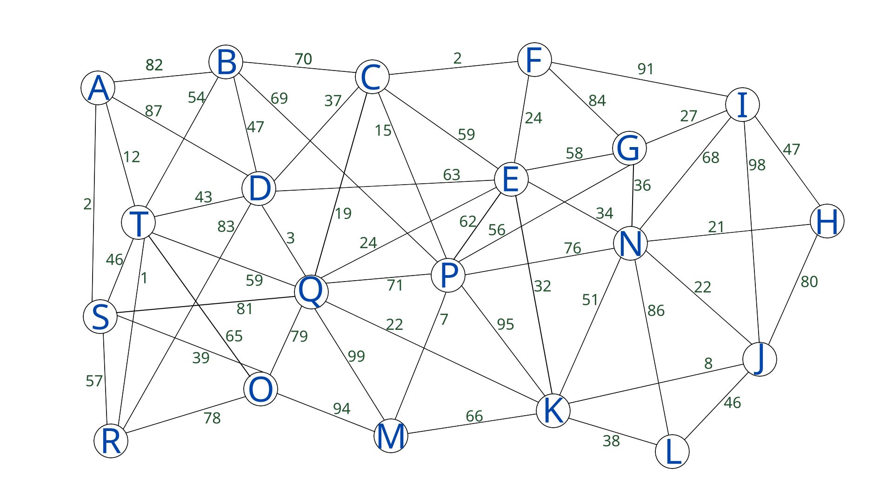
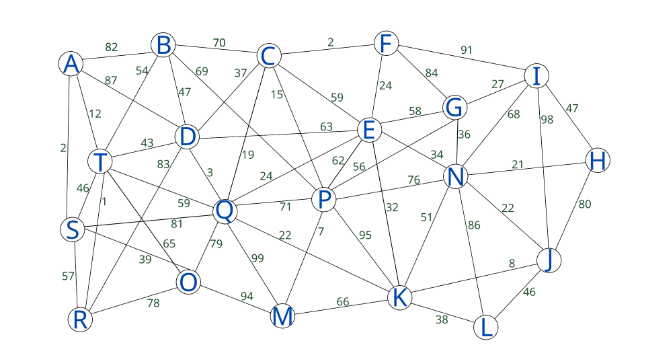
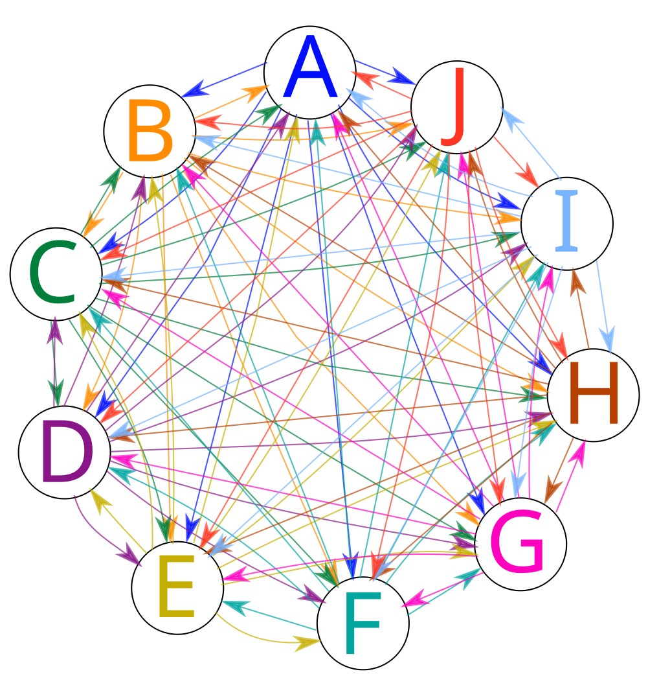
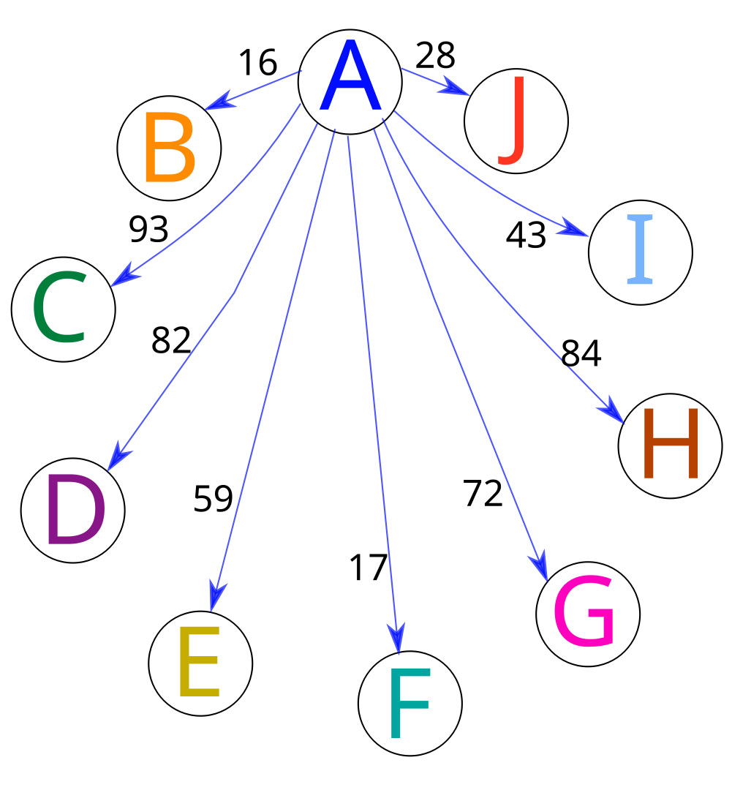
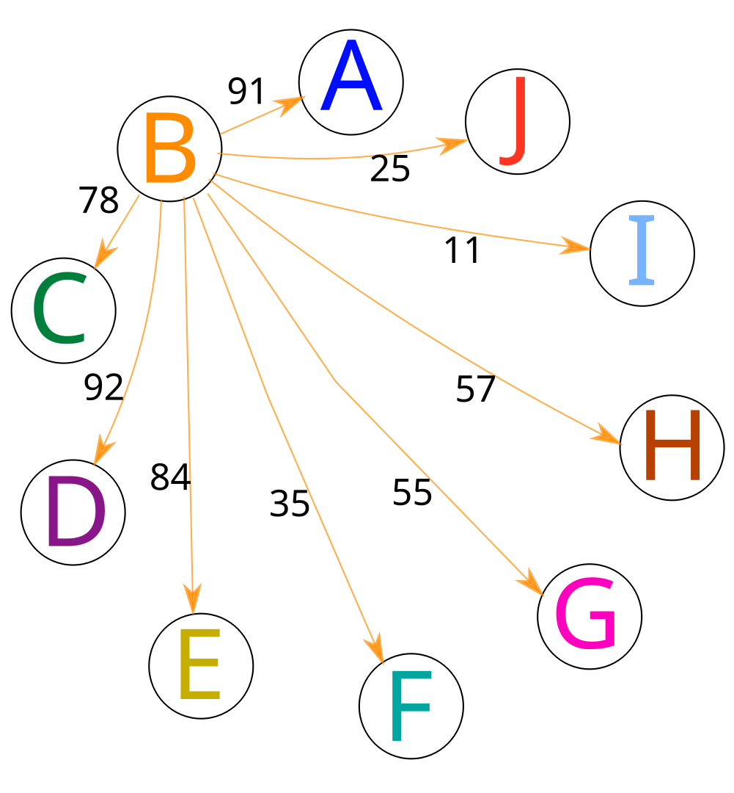
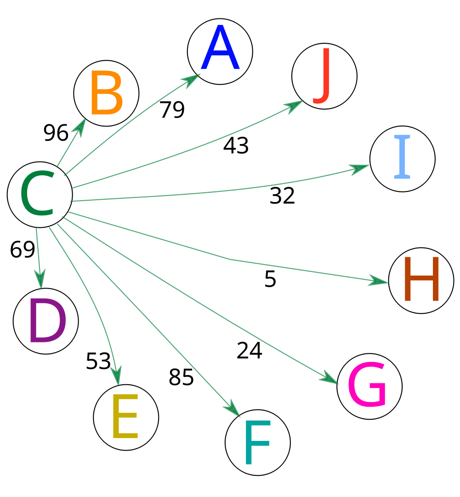
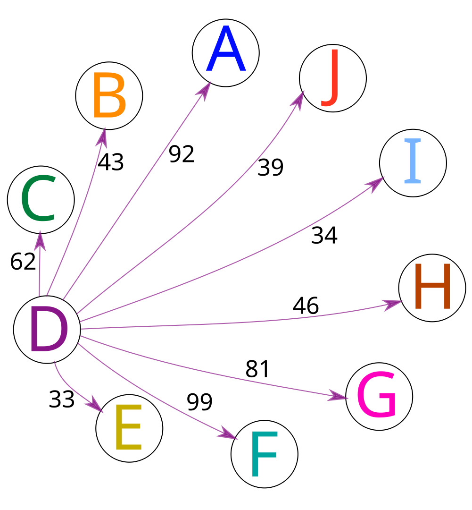
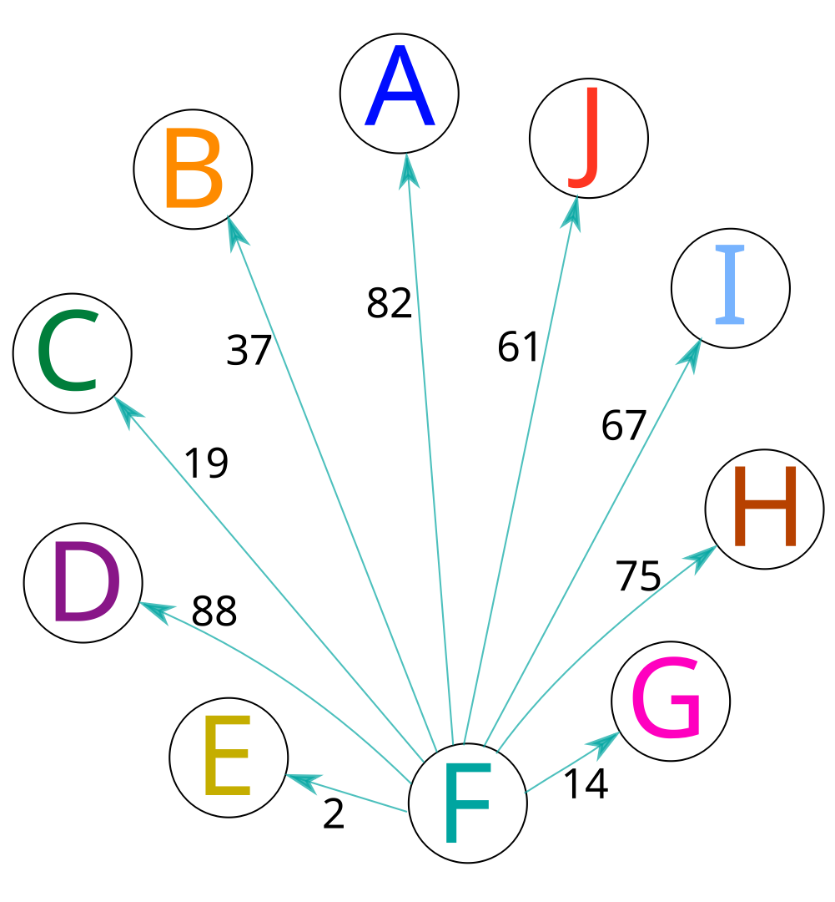
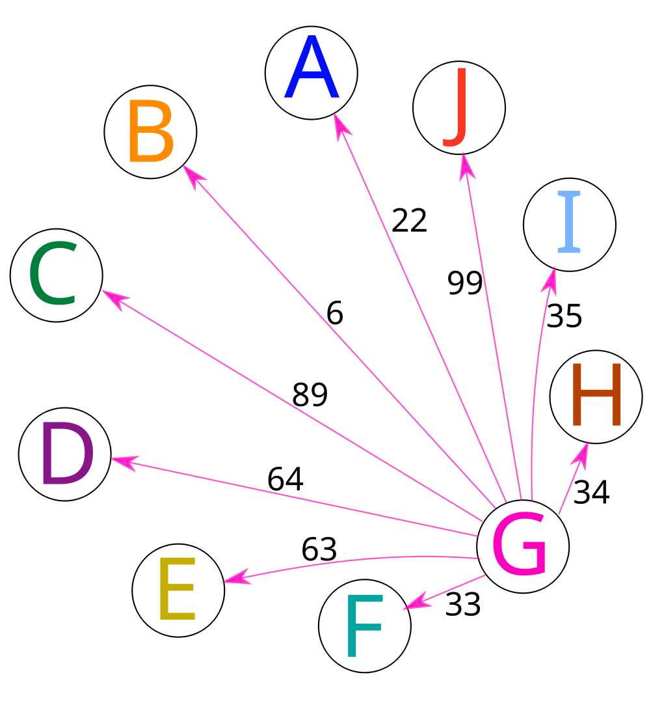
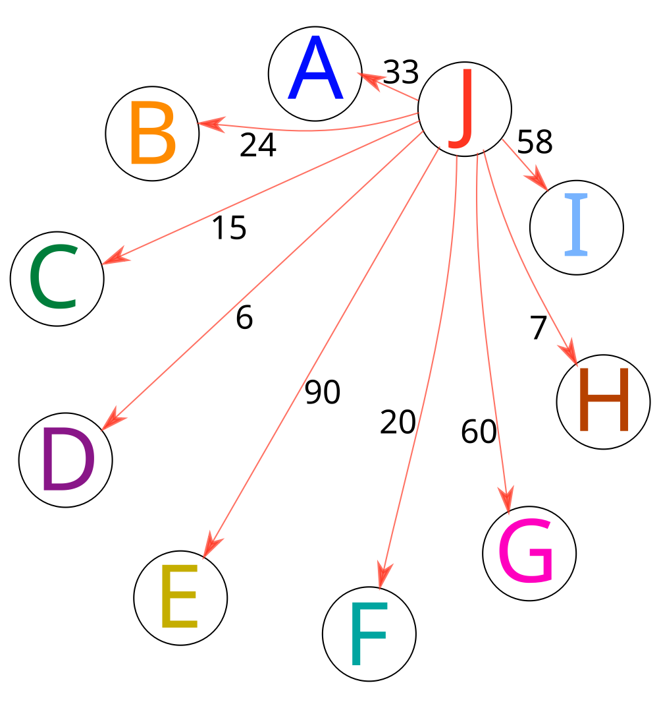

# Travelling Salesman problem

## Full graph symmetric

## Optimal path for symmetric

## Full graph asymmetric

## Roads from A

## Roads from B

## Roads from C

## Roads from D

## Roads from E

## Roads from F

## Roads from G

## Roads from H

## Roads from I

## Roads from J

