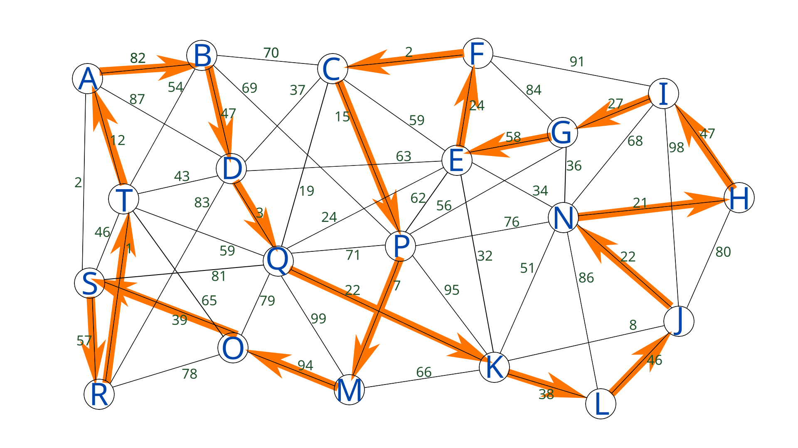
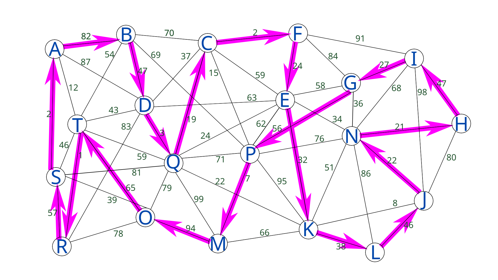

# Travelling Salesman problem

## Initial graph

## Optimal path via bounds and branches method

### Total length: 664

### Time to find: 0.327 seconds

## Optimal path via ant colony method

### Total length: 692

### Time to find: 0.166 seconds
